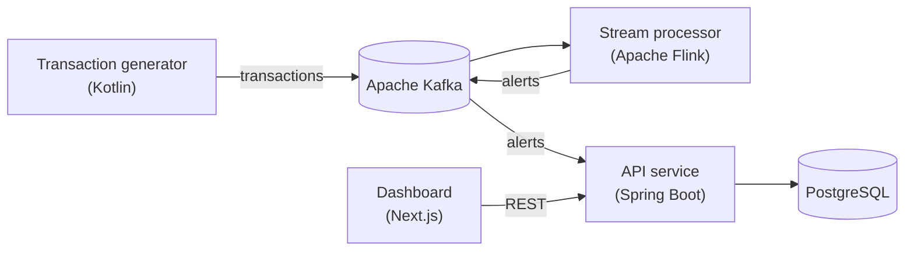

# Real Time Fraud Detection Pipeline

A streaming data platform that models how payment companies catch fraudulent
transactions the moment they occur. A Kotlin service generates a realistic stream
of card transactions into Apache Kafka. An Apache Flink job reads that stream and
applies time based aggregations and anomaly rules to flag suspicious activity. A
Spring Boot service stores the resulting alerts in PostgreSQL and serves them over
a REST API to a Next.js dashboard, which shows the live stream, the alerts, and how
detection accuracy shifts as different attack patterns are launched.

I am building this as a learning project and holding it to production standards
as it grows: typed and validated configuration, explicit delivery guarantees,
tests, versioned database migrations, protected branches, and a proper review
workflow.

> Status: active development. The transaction generator, local Kafka setup, and the
> API service scaffold work today. The alert database schema is in progress. The
> Flink processor and the dashboard are next.

## Architecture



## How it works

This section describes the target design. See [Status](#status) for what is built
today.

1. **Transaction generator (Kotlin).** A long running service that emits a steady,
   configurable stream of realistic card transactions into Kafka. Transactions are
   keyed by card ID so each card's history stays in order on one partition. The
   producer is idempotent and waits for acknowledgement from all in-sync replicas,
   so a transaction is never silently dropped or duplicated. Deliberate fraud
   scenarios such as card testing and account takeover will be published with a
   ground truth label on a separate topic, so detection accuracy can be measured
   honestly.
2. **Stream processor (Apache Flink).** Reads the transaction stream and applies
   windowed aggregations, event time watermarks for late or out of order data, and
   anomaly rules to decide which transactions look fraudulent. Flagged transactions
   are published as alerts to their own Kafka topic.
3. **API service (Spring Boot).** The system of record for alerts. It consumes the
   alert topic and persists each alert to PostgreSQL, with writes that are safe to
   repeat when Kafka redelivers a message. It exposes a REST API for listing alerts,
   viewing details, and moving an alert through its review workflow, with every
   status change kept in an audit trail. The schema is managed with Flyway
   migrations.
4. **Dashboard (Next.js).** A live view of the transaction stream, real time fraud
   alerts, controls to launch attack simulations on demand, accuracy metrics that
   compare what was detected against what was actually fraud, and short
   explanations of how the detection logic works.

## Status

### Done

* Single node Apache Kafka cluster running in KRaft mode, so no ZooKeeper, set up
  with Docker Compose. Internal, external, and controller traffic are configured on
  separate listeners, and data survives restarts.
* A transaction data model and a generator that produces randomized sample
  transactions, keyed by card ID so related transactions land on the same
  partition. The generator currently publishes a small batch of them to Kafka.
* Verified the full path from producer to broker to consumer, including how Kafka
  routes messages to partitions by key.
* Building blocks for the streaming generator, each unit tested and ready to be
  wired into the running service:
  * Configuration loaded with Hoplite from a config file, with environment
    variable overrides for every setting, and validation that reports every
    invalid field in one pass.
  * Kafka producer settings built by a pure function, with idempotence and full
    acknowledgement enabled, and a unique client ID per running instance so
    multiple instances can be told apart in broker logs and metrics.
  * An asynchronous Kafka producer with delivery callbacks that count successful
    and failed sends in thread safe counters.
  * Unit tests using Kafka's `MockProducer`, so they run without a broker.
* Spring Boot API service scaffold with a health check through Spring Boot
  Actuator.
* Repository hardening: branch rulesets, automated dependency updates, secret
  scanning that blocks leaked credentials before they are pushed, and a security
  disclosure policy.

### In progress

* Turning the generator into a real streaming service: wiring in the
  configuration and asynchronous producer above, a configurable send rate driven
  by coroutines, clean shutdown, and periodic throughput logging built on the
  delivery counters.
* Alert storage for the API service. Done so far: PostgreSQL in Docker Compose,
  Spring Data JPA and Flyway set up, and the first migration creating the
  `alerts` table. Remaining: an append only `alert_status_history` audit table,
  JPA entities and repositories, and repository tests against a real database
  with Testcontainers.

### Next

* Publishing ground truth fraud labels on a dedicated Kafka topic so accuracy can
  be evaluated later.
* Realistic per card spending behaviour and injected fraud attack patterns such as
  card testing, account takeover, and impossible travel between locations.
* A control API so attack simulations can be started and tuned live from the
  dashboard.
* The Apache Flink detection job, publishing alerts to Kafka.
* Alert ingestion in the API service: a Kafka consumer that writes alerts to
  PostgreSQL, scaling across instances with consumer groups.
* The REST API the dashboard calls, followed by JWT authentication with Spring
  Security.
* The Next.js dashboard.

## Tech stack

| Area | Tools |
| --- | --- |
| Languages and runtime | Kotlin, Kotlin Coroutines (in progress), JVM 21 |
| Streaming and messaging | Apache Kafka in KRaft mode, Apache Flink (planned) |
| Backend services | Spring Boot, Spring Boot Actuator, Spring Data JPA (in progress) |
| Storage | PostgreSQL and Flyway (in progress) |
| Frontend | Next.js, TypeScript, React, Tailwind CSS |
| Build and tooling | Gradle with the Kotlin DSL and version catalogs, Hoplite, kotlinx.serialization, kotlin-logging |
| Infrastructure | Docker, Docker Compose |
| Testing | JUnit 5, kotlin-test, Kafka MockProducer, Testcontainers (planned) |
| Practices | Conventional Commits, pull request workflow with protected branches, automated dependency updates, CI (planned) |

## Repository layout

```
backend/event_generator     Kotlin transaction generator (Gradle, JDK 21)
backend/flink_processor     Apache Flink stream processor (Gradle, JDK 21, scaffold)
backend/api_service         Spring Boot alert service and REST API (Gradle, JDK 21)
dashboard                   Next.js dashboard (scaffold)
infrastructure              Docker Compose for Kafka and supporting services
```

## Running locally

Requires Docker and JDK 21.

Start the local infrastructure:

```bash
cd infrastructure
docker compose up -d
```

Create the transactions topic:

```bash
docker compose exec kafka kafka-topics \
  --bootstrap-server localhost:9092 \
  --create --topic transactions --partitions 3 --replication-factor 1
```

Run the generator and its tests. For now it publishes a small batch of sample
transactions and exits. The continuous stream is in progress.

```bash
cd backend/event_generator
./gradlew run
./gradlew test
```

Watch the transactions arrive:

```bash
cd infrastructure
docker compose exec kafka kafka-console-consumer \
  --bootstrap-server localhost:9092 --topic transactions --from-beginning
```

Run the API service and check its health. Once alert storage lands, the service
also needs the PostgreSQL container from the infrastructure step to be running.

```bash
cd backend/api_service
./gradlew bootRun
curl http://localhost:8080/actuator/health
```

Stop the infrastructure when you are done:

```bash
cd infrastructure
docker compose down
```

## Security

See [SECURITY.md](SECURITY.md) for how to report a vulnerability.
